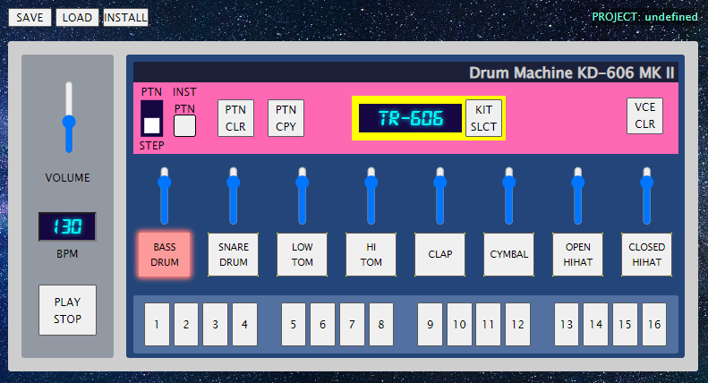

# DrumMachineKD-606
Virtual sample-based drum machine JavaScript web app

## Outline
Created as the final project assignment of two consecutive JavaScript courses. I have continued working on it for practice to expand its functionality. It shall serve as a reference of my coding.

## Authors
This app was created in collaboration with G. Geppert and further expanded by myself.

## Features
- 16 step-sequencer creating one-bar loop in 4/4-measure 
- adjustable tempo (BPM)
- 8 different drum voices for simultaneous use on sequencer steps (Step Mode)
- 5 selectable sample-based drum kits of classic drum machines
- Volume control, both globally and per voice
- 16 pattern slots to create up to 16 different rhythmic patterns (Pattern Mode)
- On-the-fly switching between patterns
- On-the-fly switching between Pattern and Step Modes
- Pattern-copy and pattern-clear function
- Voice-clear function to clear all steps of the selected voice
- Save- and loadable project files
- App is installable as a browser-based PWA

## To Run The App
Run index.html in your browser. You can install the app as a progressive web app by clicking on the "INSTALL" button.

## Save and Load
Project files are saved in the browser memory via IndexedDB.

## Issues
- Playback of newly entered steps starts with delayed timing that stabilizes only after one bar.
- Interaction of open and closed hihat regarding choking and step-overwrite needs improvement.

## Future additions
- Accent-function for accentuating selected steps in volume

## License
This is free and unencumbered software released into the public domain.

Anyone is free to copy, modify, publish, use, compile, sell, or
distribute this software, either in source code form or as a compiled
binary, for any purpose, commercial or non-commercial, and by any
means.

In jurisdictions that recognize copyright laws, the author or authors
of this software dedicate any and all copyright interest in the
software to the public domain. We make this dedication for the benefit
of the public at large and to the detriment of our heirs and
successors. We intend this dedication to be an overt act of
relinquishment in perpetuity of all present and future rights to this
software under copyright law.

THE SOFTWARE IS PROVIDED "AS IS", WITHOUT WARRANTY OF ANY KIND,
EXPRESS OR IMPLIED, INCLUDING BUT NOT LIMITED TO THE WARRANTIES OF
MERCHANTABILITY, FITNESS FOR A PARTICULAR PURPOSE AND NONINFRINGEMENT.
IN NO EVENT SHALL THE AUTHORS BE LIABLE FOR ANY CLAIM, DAMAGES OR
OTHER LIABILITY, WHETHER IN AN ACTION OF CONTRACT, TORT OR OTHERWISE,
ARISING FROM, OUT OF OR IN CONNECTION WITH THE SOFTWARE OR THE USE OR
OTHER DEALINGS IN THE SOFTWARE.

For more information, please refer to <https://unlicense.org>
